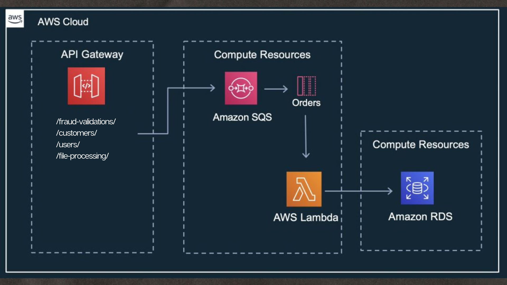

# 🎒 Juchi Credit Services 

Welcome to the official GitHub repository for Juchi Credit Services, where we specialize in financial fraud detection and credit analysis using Python. Our services are designed to be integrated seamlessly with a Messenger chatbot, enabling real-time interaction and assistance.

## 🔮 Architecture

I create a webhook through the use of node and express, I exposed my local host to the facebook webhook with ngrok, through which I send and receive the requests to messenger, when I receive a specific request For a translation I consume an internal service that I use to call the google translations API, I clean the request and send an input back, some of the requests I send them as json to IA Platform where I use them for self-training and the result I return it as a json to be able to use it in some future. The part of the images I receive the request, if when I receive it I detect it as an image I receive it, I send it to my service and I consume the image processing api to be able to detect the elements of the image.



## 👨🏻‍💻 Tech Stack

- ✅ Messenger Platform
- ✅ Python Flask
- ✅ Ngrok
- ✅ Google Colab
- ✅ IA Platform
- ✅ Amazon Web Services

### Features
* **Fraud Detection**: We use cutting-edge machine learning algorithms and data analysis techniques to identify suspicious patterns and prevent financial fraud.

* **Credit Analysis** : Our tools assess credit histories thoroughly, providing financial institutions with a detailed understanding of credit risk associated with each client.

* **Messenger Chatbot Integration** : We provide a smooth integration with a Messenger chatbot, facilitating interactive and automated customer support directly through Facebook Messenger.

### Getting Started

To begin using Juchi Credit Services, please follow the steps outlined below:

Clone the Repository: 
```bash 
git clone https://github.com/JuchiCreditServices/juchi-credit-services.git
```

Install Dependencies:

```bash
cd juchi-credit-services
pip install -r requirements.txt
```

### Set Up Environment:
Ensure that you set up the necessary environment variables as outlined in the config/ directory documentation.

### Run the Services:
Use the provided scripts to start the services and begin real-time data analysis.

### Documentation
For detailed information on configuration and usage of each service, refer to the documentation available in the docs/ directory.

### Contributing
We welcome contributions to improve Juchi Credit Services. If you're interested in contributing, please read our contribution guide in CONTRIBUTING.md.

### License
This project is licensed under the MIT License. For more information, see the LICENSE.md file.

### Contact
If you have questions, comments, or need assistance, please contact us at support@juchicreditservices.com.
